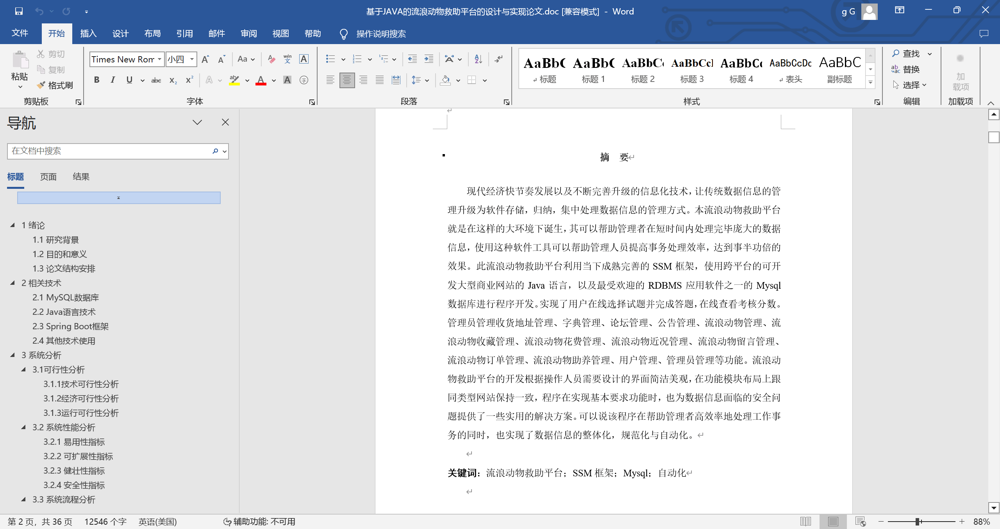
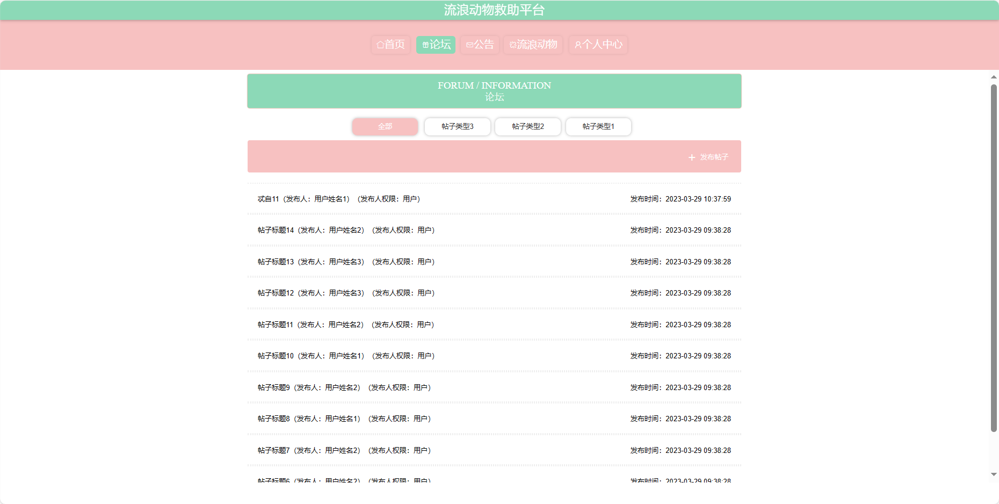
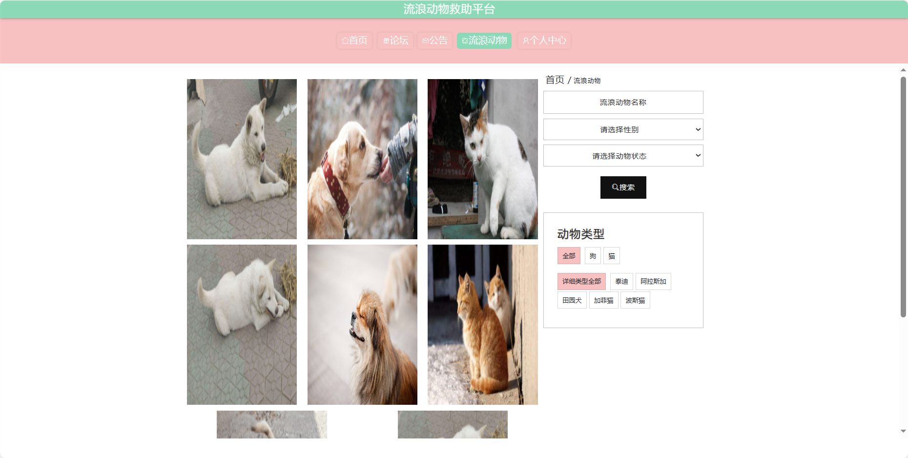
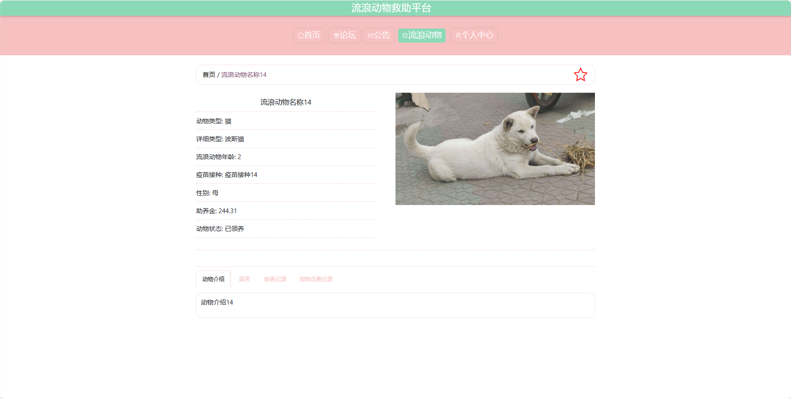
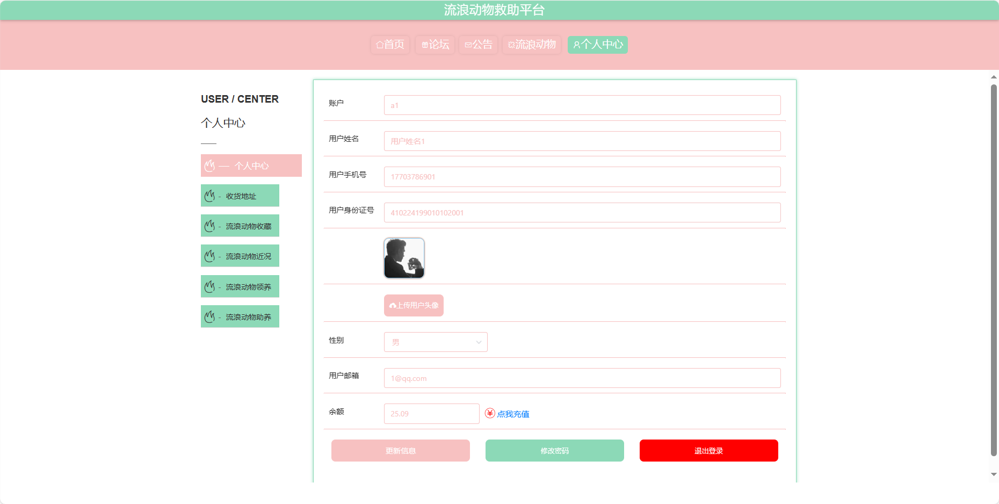
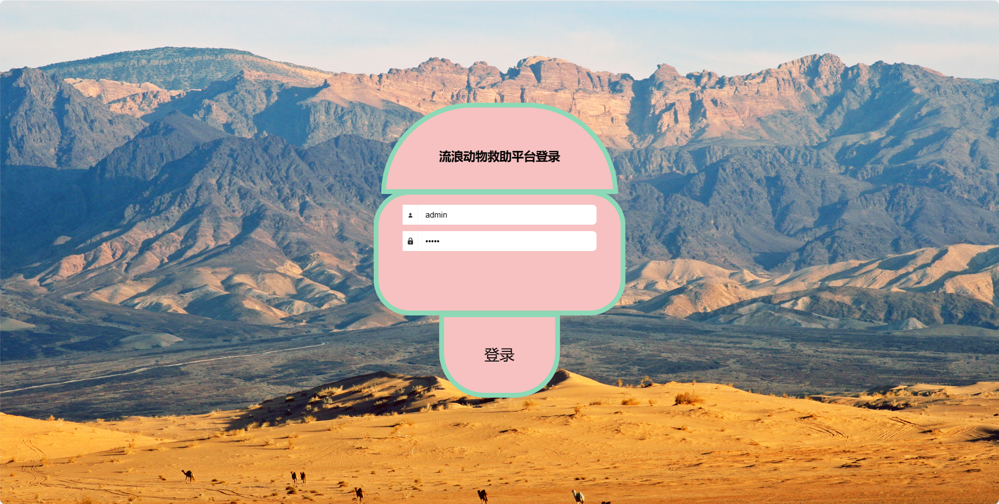
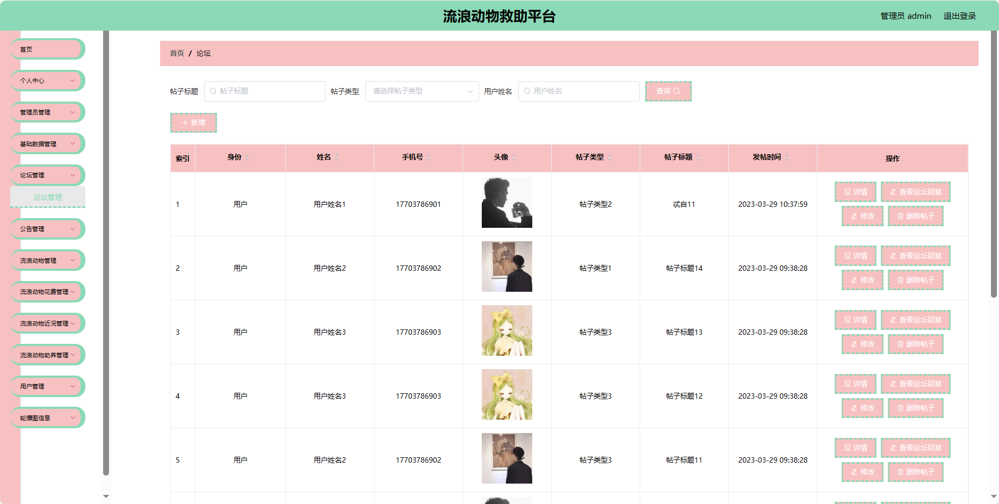
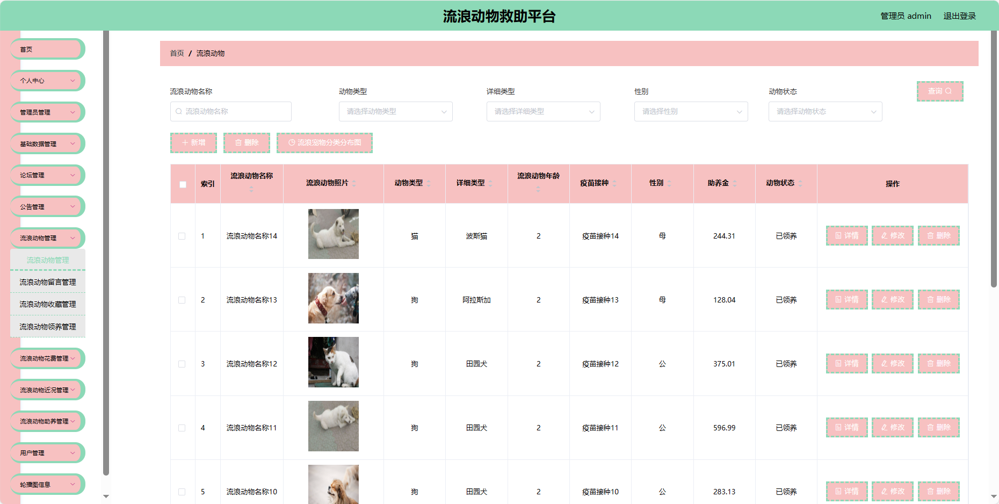

## 基于SpringBoot的流浪动物救助平台(程序+报告)

###  获取sql数据库文件: 从戎源码网 (https://armycodes.com/) QQ: 386869957 QQ群: 377586148
###  所有系统地址: (https://github.com/YuLin-Coder/AllProjectCatalog) 
###  所有项目以及源代码本人均调试运行无问题 可支持远程安装部署调试、定制修改、代码讲解

## 项目介绍
基于SpringBoot的流浪动物救助平台，系统包含两种角色：管理员、用户,系统分为前台和后台两大模块，主要功能如下。

### 【管理员】:
1. 首页：提供管理员进入后台管理的入口。
2. 个人中心：管理员可以管理个人信息。
3. 管理员管理：添加、编辑、删除系统管理员账号，。
4. 基础数据管理：管理系统的基础数据。
5. 论坛管理：管理论坛板块。
6. 公告管理：发布、编辑、删除系统通知和公告。
7. 流浪动物管理：添加、编辑、删除流浪动物的信息。
8. 流浪动物花费管理：记录和管理流浪动物的救助和护理花费。
9. 流浪动物近况管理：更新流浪动物的救助和康复情况。
10. 流浪动物助养管理：管理用户对流浪动物的助养申请和助养情况。
11. 用户管理：管理用户的参与权限。
12. 轮播图信息：管理员可以设置首页轮播图。

### 【前台】:
1. 首页：提供用户进入系统的入口。
2. 论坛：用户可以在论坛上进行关于流浪动物的讨论和交流。
3. 公告：系统发布的通知和公告。
4. 流浪动物：用户可以查看平台上发布的流浪动物信息。
5. 个人中心：用户可以管理个人信息。

## 项目技术
- 编程语言：Java
- 数据库：MySQL
- 项目管理工具：Maven
- 前端技术：HTML、CSS、JavaScript、Jquery、Vue
- 后端技术：Spring、SpringMVC、MyBatis

## 运行环境
- JDK版本：JDK1.8及以上
- 开发工具：IDEA、Ecplise、Myecplise都可以
- 数据库: MySQL5.7及以上
- Maven：maven3.0及以上
- Node：14.14.0及以上

## 运行截图

